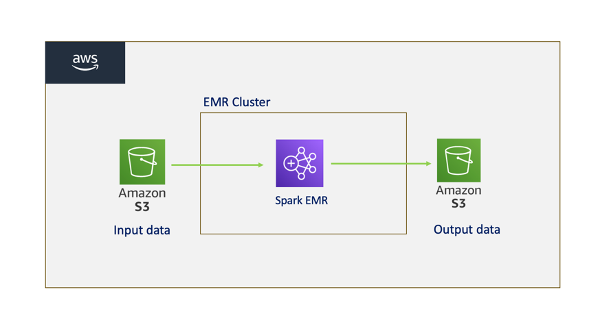

# Spark-LLM-AWS-EMR: Distributed Neural Network Training and Sentence Generation

**Author**: Sunil Kuruba <br />
**Instructor**: Mark Grechanik <br />
**Youtube video**: https://www.youtube.com/watch?v=dTjj6qQInEw <br />

## Description
This project showcases a scalable training pipeline for a neural network leveraging Apache Spark for distributed data processing and deep learning capabilities. The `Train` class is designed for comprehensive model training with built-in support for self-attention mechanisms, enhancing the embedding process for better model performance. Key aspects include reading configurations, handling data preprocessing with Spark RDDs, and training over multiple epochs with detailed metric tracking. The self-attention implementation computes query, key, and value matrices to enrich the representation learning phase. The main execution logic, contained in the `Main` object, sets up the environment, manages data input from local or cloud-based sources like S3, and writes results and training metrics. Integration with DL4J (`MultiLayerNetwork`, `ParameterAveragingTrainingMaster`) and ND4J (`INDArray`, `Transforms`) facilitates model configuration and parameter optimization, allowing for seamless execution in distributed settings. The code demonstrates an efficient blend of Spark-based parallelism with deep learning, making it suitable for large-scale NLP and machine learning tasks.



## Project Structure

```bash
├── src
│   ├── main
│   │   ├── scala
│   │   │   ├── FileSystem.scala           # Module for file operations (read/write)
│   │   │   ├── Main.scala                 # Main entry point for the application
│   │   │   ├── NNModel.scala              # Neural network model and architecture
│   │   │   ├── TextOutput.scala           # Handles the text output formatting
│   │   │   ├── Tokenizer.scala            # Tokenization logic for input data
│   │   │   ├── Train.scala                # Module to train the LLM model
│   │   ├── resources
│   │   │   ├── input
│   │   │   ├── output
│   │   │   ├── application.conf           # Configuration file for project settings
│   ├── test
│   │   ├── scala
│   │   │   ├── EndToEndIntegrationSpec.scala      # End-to-end integration tests
│   │   │   ├── ModelTrainingIntegrationSpec.scala # Integration tests for model training
│   │   │   ├── NNModelSpec.scala                  # Unit tests for the NN model
│   │   │   ├── TestUtility.scala                  # Utility functions for testing
│   │   │   ├── TokenizerSpec.scala                # Unit tests for the tokenizer logic
│   │   ├── resources
│   │   │   ├── input
│   │   │   ├── output
├── target                                 # Compiled files and build output
├── .gitignore                             # Git ignore file
├── build.sbt                              # Build configuration file for SBT
└── README.md                              # Project documentation
```

## Prerequisites

1. Apache Spark (version 3.x recommended)
2. Scala (version 2.12 or compatible)
3. AWS EMR cluster setup and configured
4. AWS S3 setup and configured
4. SBT (Scala Build Tool) for building the project
5. Java Development Kit (JDK) 8 or higher

Here's an expanded and more detailed version of your markdown file:

---

## Steps to Execute the Project

### 1. Setup the Project Environment
- Start by cloning the repository to your local machine to access all the necessary files:
  ```bash
  git clone https://github.com/SunilKuruba/Spark-LLM-AWS-EMR.git
  cd CS_441_spark
  ```
- Ensure that you have `sbt` (Scala Build Tool) installed to compile and manage the project dependencies.

### 2. Prepare AWS
* **Create an S3 bucket**: This will be used to store the compiled JAR files and input training data. Make sure to note down the S3 bucket name and paths as they will be needed for later steps.
* **Upload the input training data**:
  - Organize your S3 bucket with the following folder structure:
  ```bash
  ├── jar
  │   └── spark_hw2.jar                 # Compiled executable JAR file
  ├── input
  │   ├── train.txt                     # Input training text file
  ├── output                            # Output folder (initially empty)
  ```

### 3. Input Data Preparation
- Prepare your training data by uploading any necessary input text files to the designated S3 `input` folder.
- Modify the `application.conf` file in the project directory to update the `prod` variables as per your configuration. Ensure that the paths to your S3 input and output directories are set accurately:
  ```hocon
  prod {
    inputPath = "s3://<your-bucket-name>/input/train.txt"
    outputPath = "s3://<your-bucket-name>/output/"
  }
  ```

### 4. Prepare JAR
- Compile the project to generate the necessary `.jar` file using the following `sbt` commands:
  ```bash
  sbt clean update compile
  ```
- Package the project:
  ```bash
  sbt package
  ```
- Once the `.jar` file has been created, upload it to your S3 bucket:
  ```bash
  aws s3 cp target/scala-2.12/CS_441_Spark-assembly-0.1.jar s3://<your-bucket-name>/jar/
  ```

### 5. Deploy to AWS EMR
- **Create an EMR Cluster**:
  - Log in to your AWS Management Console and navigate to the EMR service.
  - Create a new EMR cluster, ensuring that it includes Spark and is configured with appropriate instance types and sizes based on your project’s resource needs.
- **Upload the JAR as a Step**:
  - Once the cluster is running, add a step to the cluster by selecting "Add step," choosing "Spark application," and specifying the path to the JAR file in your S3 bucket.

### 6. Run the Training
- Start the Spark job by executing the added step on your EMR cluster. This step will initiate the distributed training process on the dataset provided in the S3 bucket.
- Monitor the job progress via the EMR console or Spark web UI for real-time updates.

### 7. Results
- Once the training is complete, the model will produce output, which includes generated sentences from the given seed input, demonstrating the model's sentence prediction capabilities.
- Access the results in your designated S3 `output` folder. The folder should contain generated text files and other relevant logs or statistics related to the training job.

## Testing
- To validate the implementation, run the provided test cases locally using SBT:
  ```bash
  sbt test
  ```
- Ensure that your test environment has the necessary libraries and dependencies installed for successful test execution.
